# 01. 课程简介

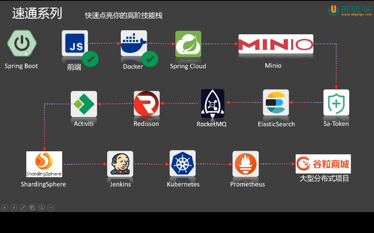

## 课程介绍与学习目标
- Docker 的出现推动了运维部署进入容器化时代，极大提升了开发与运营效率。
- Docker 已成为程序员必备技能。
- 本课程通过提炼核心内容，以实战方式全程实操，配合动画辅助，帮助学习者快速掌握 Docker 的核心功能。
- 学习门槛较低，具备 Linux 基础即可。

## 课程结构
课程分为五个章节：
1. Docker 命令
2. Docker 存储
3. Docker 网络
4. Docker Compose
5. Dockerfile

## 实战演示内容
课程最后将实战演示：使用 Docker 一键批量启动常用中间件，包括：
- MySQL
- Redis
- RabbitMQ
- Zookeeper
- OpenSearch
- Kafka
- Nacos
- Prometheus
- Grafana

通过该实战，帮助学习者更进一步接近架构师水平。

## 学习前提与适用人群
- 学习者需具备 Linux 基础。
- 适合希望快速掌握 Docker、提升部署与运维能力的开发者。

# 02. 基础 - 为什么有Docker

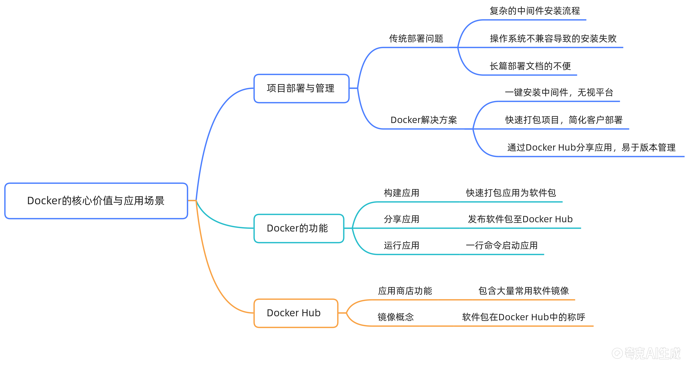

## Docker产生的背景与核心痛点

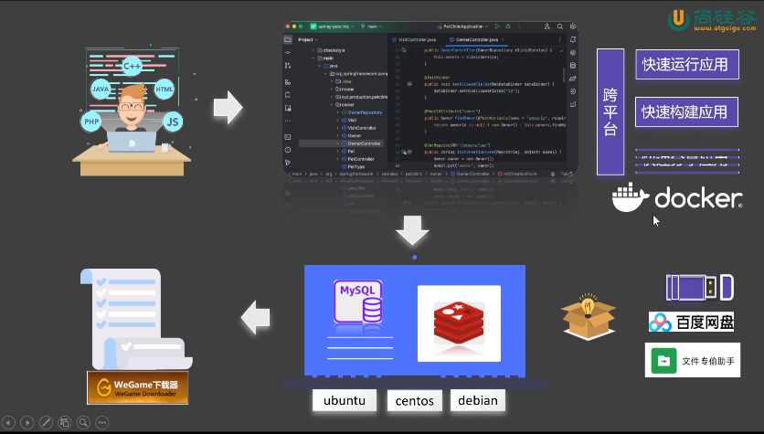

### 开发环境搭建的复杂性
- 作为全干工程师，接手项目后需在服务器上安装MySQL、Redis等中间件。
- 搜索Linux安装文档进行复制粘贴时，**<span style="color:#ff0000;">常因操作系统适配问题</span>**（如无法区分Ubuntu、CentOS或Debian）导致运行失败。

### 项目交付部署的低效性
- 项目开发完成后，需为客户编写长达30页的详细部署文档（包括安装Java环境、MySQL、Redis等步骤）。
- 客户认为操作繁琐，期望像下载游戏一样一键安装。

### 软件版本管理与分发的困难
- 通过U盘、网盘或文件传输助手发送软件包时，面临链接丢失、版本混淆（如1.0版本找回困难）以及多版本维护不易的问题。
- 用户期望拥有类似手机应用商店的便捷体验。

## Docker的解决方案

### 跨平台快速运行
- Docker技术能够无视平台差异，通过一行命令快速安装并运行所需软件，解决环境配置难题。

### 快速构建与打包
- Docker能够将整个项目打包成一个软件包，实现应用的快速构建，让客户拿到软件包后可直接运行，简化交付流程。

### 快速分享与应用商店

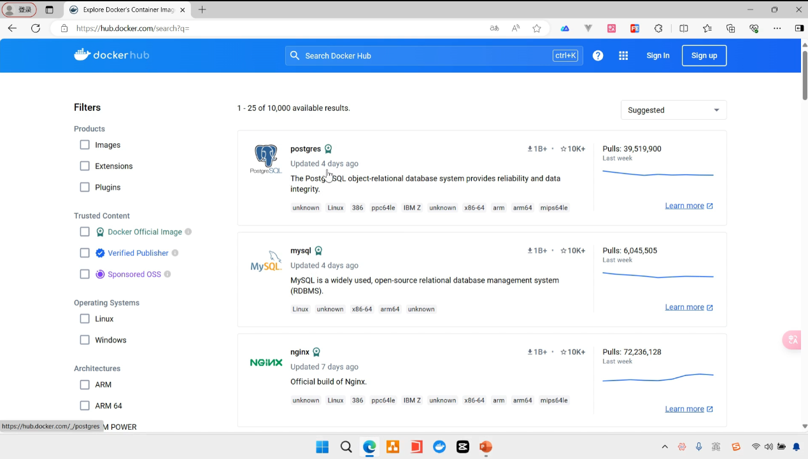

- Docker提供**Docker Hub**作为应用商店，开发者可将软件包发布至Docker Hub，用户可直接从中下载安装使用。
- Docker Hub中包含MySQL、Nginx、MongoDB、Python环境、Memcached等常用软件的镜像。

## Docker的核心概念定义

### 镜像（Image）
- **<span style="color:#ff0000;">发布到Docker Hub上的软件包被称为“镜像”。</span>**

### Docker的官方定义

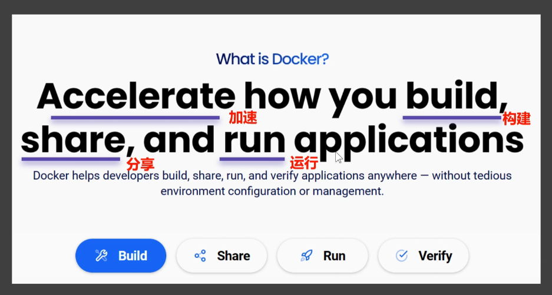

- **<span style="color:#ff0000;">Docker是用来加速应用的构建（Build）、分享（Share）和运行（Run）的工具。</span>**
- **构建**：快速将应用打包。
- **分享**：将软件包快速发布到Docker Hub等应用商店。
- **运行**：通过一行命令启动应用。

## 课程学习目标
- 后续学习将围绕Docker的三大核心功能展开：如何构建应用、分享应用以及运行应用。


# 03. 基础 - Docker架构与容器化

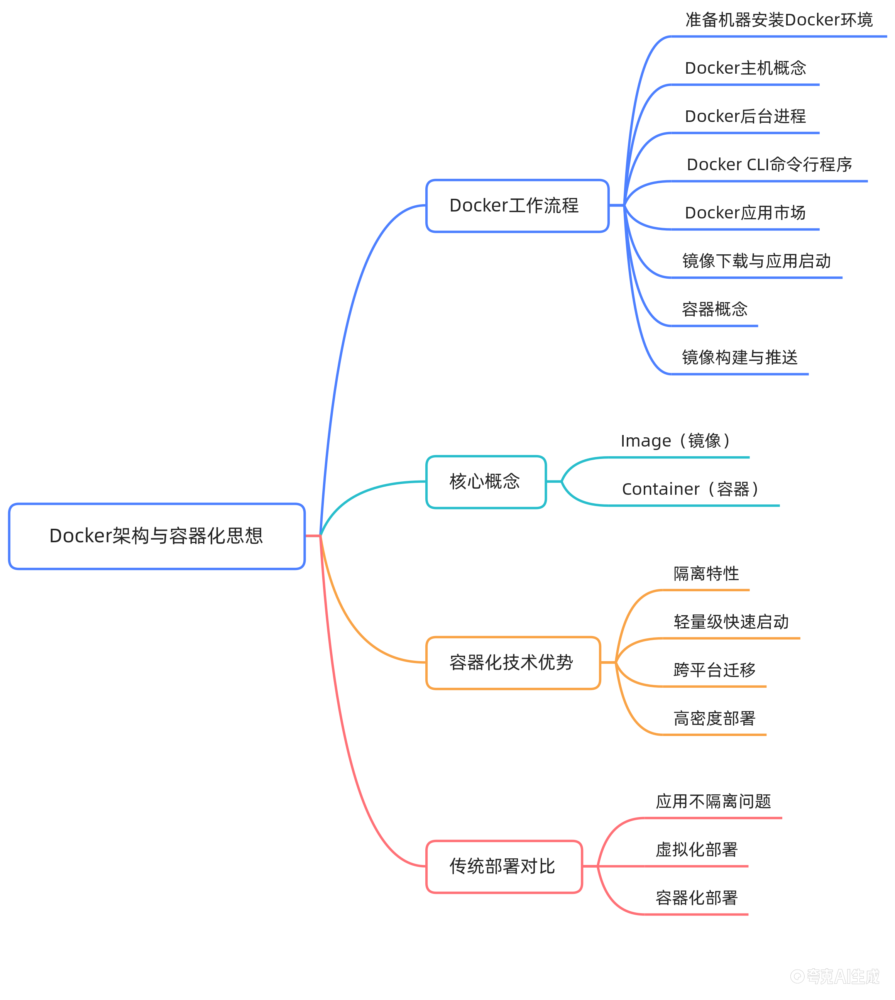

## 一Docker 架构与工作流程

### Docker 环境组成

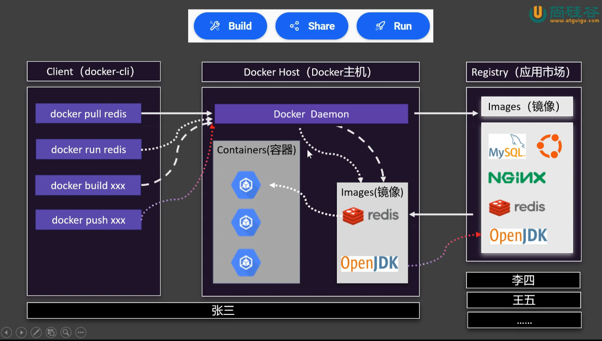

- **Docker 主机（Docker Host）**：安装了 Docker 环境的机器。
  - **Docker Daemon**：后台进程，时刻运行并准备提供服务。
  - **Docker CLI**：命令行客户端，用于向 Docker Daemon 发送操作命令。
  - **Docker Registry**：应用市场，集中存储如 MySQL、Ubuntu、Redis 等软件镜像。

### 镜像下载与容器启动流程（以 Redis 为例）
1. 执行 `docker pull redis` 命令，CLI 将请求发送给 Docker Daemon。
2. Docker Daemon 连接应用市场下载 Redis 镜像至本机。
3. 执行 `docker run redis` 命令，Docker Daemon 在本地查找镜像（若不存在则自动下载）。
4. 利用该镜像启动应用，此时运行的应用实例称为“容器”。

### 镜像构建与分享流程
- **构建镜像**：使用 `docker build` 命令制作软件镜像。
- **推送镜像**：使用 `docker push` 命令将本地镜像推送到应用市场。
- **分享机制**：其他用户可通过 `docker pull` 下载该镜像，并使用 `docker run` 在各自机器上运行。

### 核心命令总结
- 构建软件包：`docker build`
- 分享应用：`docker push`（推送）、`docker pull`（下载）
- 运行应用：`docker run`

## 二、核心概念：镜像与容器
- **镜像（Image）**：**<span style="color:#ff0000;">本质是软件包。</span>**
- **容器（Container）**：<span style="color:#ff0000;">**由镜像启动的运行中的应用实例。**</span>

## 三、容器化技术的演进与优势

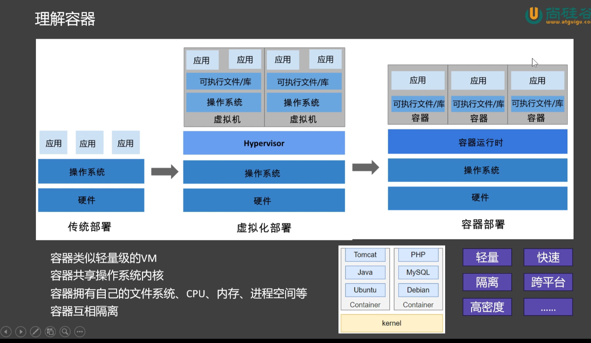

### 传统部署的问题
- 直接在操作系统上部署应用缺乏隔离性。
- 若某应用发生内存泄露等资源故障，会挤压其他应用生存空间，导致整体系统崩溃。

### 虚拟化部署的局限
- **原理**：利用虚拟化技术创建虚拟机，每个应用部署在独立的虚拟机内，实现了隔离。
- **缺点**：每个虚拟机包含完整的操作系统，导致资源占用大、笨重。

### 容器化部署的原理
- **原理**：**<span style="color:#ff0000;">在操作系统上安装容器运行时环境，每个应用运行在独立的容器中。</span>**
- **隔离性**：容器类似于集装箱，封装了应用及其完整运行环境，容器间互相隔离。某容器故障仅影响自身，不波及其他容器。
- **轻量化**：容器共享宿主机的操作系统内核，无需为每个应用配备完整操作系统。
- **文件系统独立性**：虽然共享内核，但每个容器拥有独立的文件系统、CPU 和内存竞争空间。

## 四、容器化技术的核心优势
- **轻量级与快速启动**：不包含笨重的操作系统，资源占用极少，可实现秒级启动，远快于虚拟机。
- **隔离性**：容器之间互相隔离，互不影响，保障了应用的稳定性。
- **跨平台与可移植性**：只要目标机器安装了容器运行时环境，容器即可直接迁移运行。
- **高密度部署**：单位资源空间内可部署的容器数量远多于虚拟机，提升了资源利用率。
- **行业地位**：容器化部署已成为事实标准，被绝大多数公司采用。

# 04.基础 - 购买云服务器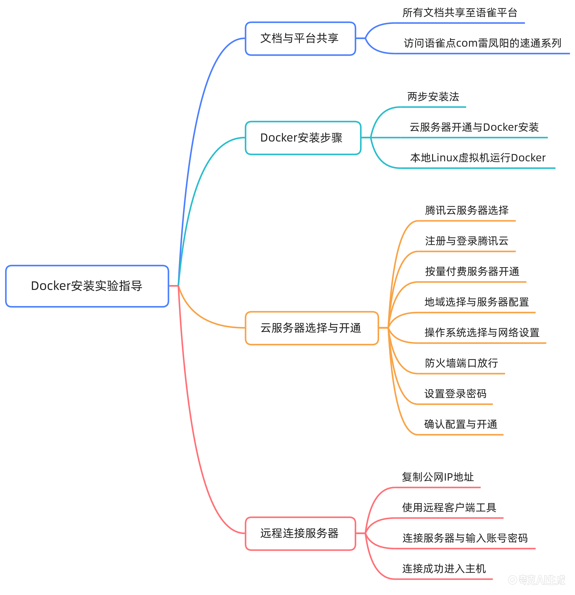

## 一、前期准备与平台共享
- 安装规划：分为两步。第一步开通云服务器（或使用本地 Linux 虚拟机），并在其上安装 Docker；建议开通云服务器，用完即删以节约时间。
- 平台选择：选择**腾讯云**（阿里云最低充值 100 元对新手不友好）。云服务器厂商对新手有优惠活动，但实验期间建议采用**按量付费**模式。

## 二、云服务器选择与开通
- **登录腾讯云**：扫码登录腾讯云控制台，进入产品页，点击“云服务器”进行开通。
- **地域选择**：选择所在的地域以提升访问速度（示例选择“南京一区”）。
- **计费模式**：选择**按量计费**（即用几小时花几小时的钱，类似网吧上网）。
- **具体配置**：
  - 服务器配置选择“两核两G”。
  - 费用约为每小时 0.21 元，加上配置费用合计约每小时 0.26 元。

## 三、操作系统与网络设置
- **镜像选择**：选择操作系统镜像，示例中选择 **CentOS 7.9**（语音识别误为 windows 7.9）。
- **网络设置**：
  - 使用默认分配的网络信息。
  - 选中“分配独立公网IP”，以便能远程连接服务器。
  - 带宽计费：选择“按流量计费”，带宽大小不影响费用，仅收取流量费（1G 约 0.8 元）。

## 四、安全组与密码设置
- **安全组配置**（相当于服务器防火墙）：
  - 需放行端口：**80 端口**（Web）、**443 端口**（HTTPS）、**22 端口**（远程登录端口）。
- **登录密码设置**：
  - 密码必须包含大写字母、小写字母、数字及特殊符号。
  - 设置完成后点击下一步确认配置。

## 五、服务器创建与启动
- 确认配置信息：两核两G、CentOS 7.9 镜像、拥有公网IP、按流量计费。
- 点击“我已阅读协议开通”启动服务器。
- 预计整个实验期间费用十余元即可满足需求。
- 服务器状态变为“运行中”后，系统会分配一个公网IP地址。

## 六、远程连接服务器
- **复制公网IP**：复制服务器分配的公网IP地址。
- **连接工具**：使用 **WindTerm**（语音识别误为 winter term）。
  - 下载链接：https://github.com/kingToolbox/WindTerm/releases/download/2.6.0/WindTerm_2.6.1_Windows_Portable_x86_64.zip
- **新建会话**：
  - 主机地址填写复制的公网IP。
  - 标签命名为“docker host”。
- **登录验证**：
  - 账号输入“root”。
  - 输入开通服务器时设置的复杂密码。
  - 连接成功后进入主机界面，准备在下节课进行 Docker 安装。

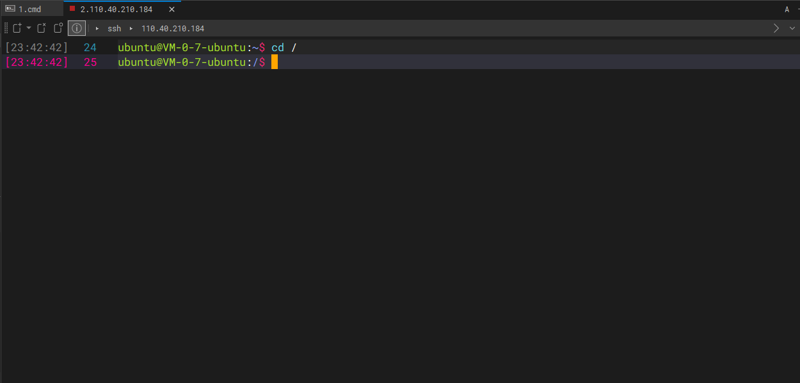

# 05. 基础 - 停机不收费

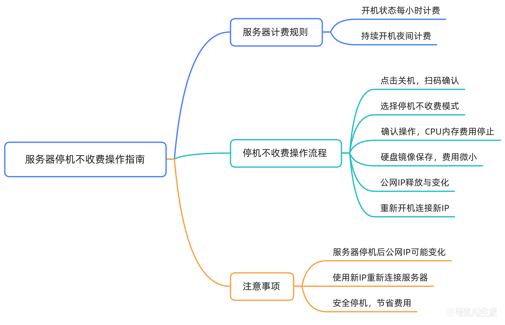

## 一、功能背景与计费原理
- 服务器在开机状态下会持续计费，每小时约一块多，即使夜间闲置也会产生费用。
- 为节省成本，可使用“停机不收费”功能。

## 二、操作步骤与费用说明
- **执行关机**：点击关机并进行扫码确认。
- **选择模式**：在弹出的停机界面中选择“关机不收费”。
- **费用减免详情**：
  - CPU 和内存费用停止计费。
  - 硬盘镜像费用继续计费，因为需要保存操作系统及用户数据，防止改动丢失。
  - 硬盘费用极低，每月仅一两块钱，几乎可忽略不计。
- **确认操作**：选择“关机不收费”模式后点击确定。

## 三、关键注意事项：公网IP变化
- **IP释放机制**：由于服务器默认绑定普通公网IP，关机后该公网IP会被系统释放。
- **IP变更风险**：下次开机时，服务器可能会分配一个新的公网IP，导致原IP失效。
- **应对方法**：若IP发生变化，需使用新分配的IP进行连接，操作稍显繁琐。

## 四、重启与重新连接演示
- **状态确认**：界面显示服务器“已关机”。
- **执行开机**：点击“开机”按钮并确认，等待开机完成。
- **获取新IP**：开机完成后，系统生成新的公网IP，需复制该新IP。
- **更新连接配置**：
  - 在连接工具界面点击属性。
  - 将旧IP替换为新复制的IP。
  - 点击保存。
- **重新连接**：双击连接，确认指纹（yes to all），成功重新连接服务器。

## 五、总结与建议
- 每次操作结束后，建议让服务器停机以停止计费。
- 此方式适合非24小时连续运行的场景，可有效节省成本，让用户安心休息或处理其他事务。


# 06. 基础 - 安装 Docker（结合 Ubuntu 系统调整）

> 说明：原视频教程基于 CentOS 系统（使用 `yum` 包管理器）。由于实际学习环境为 Ubuntu（`6.8.0-124-generic`），以下命令均已适配为 `apt` 包管理器，并补充了实际操作中遇到的排错与验证步骤。

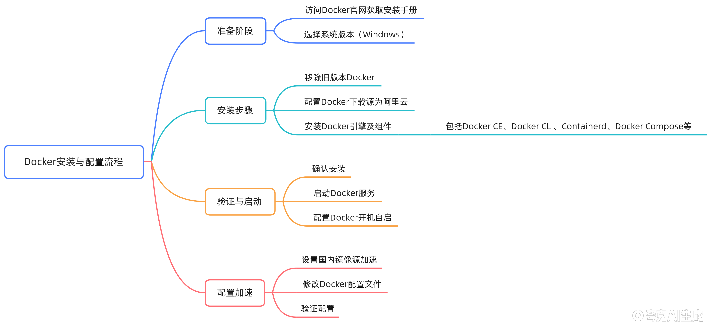

## 一、参考官方文档与准备工作
- 安装 Docker 前可访问 docker.com 开发者文档，选择 **Docker Engine Install**。
- 官方文档地址：[https://docs.docker.com/](https://docs.docker.com/)
- 根据当前系统版本（Ubuntu）获取对应的安装步骤和命令。

## 二、环境检查（安装前建议执行）
在直接执行添加 GPG 密钥和配置 apt 源之前，先检查系统是否已有相关配置，避免重复添加或产生冲突。

```bash
# 1. 查看 Docker 是否已安装
docker --version
dpkg -l | grep docker

# 2. 查询 GPG 密钥是否存在（现代 Docker 格式）
ls -l /etc/apt/keyrings/docker.gpg
# 查询旧格式密钥
ls -l /usr/share/keyrings/docker-archive-keyring.gpg

# 3. 查询 APT 源是否已配置
ls -l /etc/apt/sources.list.d/docker.list
cat /etc/apt/sources.list.d/docker.list

# 4. 查询 apt 是否识别到 docker-ce 软件包
apt-cache policy docker-ce
```

- 如果以上文件不存在，说明系统干净，按下方步骤操作即可。
- 如果部分存在，建议先清理旧配置再重新执行。

## 三、第一步：移除旧版本 Docker

执行命令移除系统中可能存在的旧版本 Docker。若是新系统可跳过此步，但建议执行以确保环境干净。

```bash
# 移除旧版本docker (Ubuntu)
sudo apt remove docker docker-engine docker.io containerd runc
```

## 四、第二步：配置 Docker 下载源（阿里云镜像）

- **更新系统并安装依赖工具**：安装 `ca-certificates`、`curl`、`gnupg` 等工具。
- **添加官方 GPG 密钥**：验证软件包的真实性。
- **配置阿里云镜像源**：由于直接连接 Docker 官网下载速度较慢，需将下载源配置为阿里云地址。

```bash
# 1. 更新apt包索引并安装依赖
sudo apt-get update
sudo apt-get install -y ca-certificates curl gnupg

# 2. 添加Docker官方GPG密钥
sudo install -m 0755 -d /etc/apt/keyrings
curl -fsSL https://download.docker.com/linux/ubuntu/gpg | sudo gpg --dearmor -o /etc/apt/keyrings/docker.gpg
sudo chmod a+r /etc/apt/keyrings/docker.gpg

# 3. 设置稳定版仓库 (使用阿里云镜像加速源)
echo \
  "deb [arch=$(dpkg --print-architecture) signed-by=/etc/apt/keyrings/docker.gpg] https://mirrors.aliyun.com/docker-ce/linux/ubuntu \
  $(. /etc/os-release && echo "$VERSION_CODENAME") stable" | \
  sudo tee /etc/apt/sources.list.d/docker.list > /dev/null
```


**验证源配置是否成功：**

```bash
# 查看 docker.list 文件是否存在及内容
ls -l /etc/apt/sources.list.d/docker.list
cat /etc/apt/sources.list.d/docker.list
```


如果输出类似 `deb [arch=amd64 signed-by=...] https://mirrors.aliyun.com/docker-ce/linux/ubuntu noble stable`，说明源配置成功。

## 五、第三步：安装 Docker 引擎

- **安装内容说明**：包含 **Docker CE**（社区版引擎）、**Docker CLI**（命令行程序）、**[containerd.io](https://containerd.io/)**（运行时容器环境）以及构建镜像所需的插件工具和 **Docker Compose**。

```bash
# 更新apt源并安装最新docker
sudo apt-get update
sudo apt-get install -y docker-ce docker-ce-cli containerd.io docker-buildx-plugin docker-compose-plugin
```

> 提示：安装过程会下载约 101 MB 的文件，耐心等待即可。Ubuntu 安装后默认不会自动启动服务，需进行下一步。

## 六、第四步：启动 Docker 服务与配置权限

- **立即启动**：启动 Docker 服务。
- **设置开机自启**：确保 Docker 在系统开机时自动启动。
- **解决权限问题**：默认情况下，普通用户执行 `docker ps` 会报 `permission denied` 错误，需将用户加入 docker 组。

```bash
# 1. 启动 Docker 并设置开机自启（enable + start 二合一）
sudo systemctl enable docker --now

# 2. 将当前用户加入 docker 组
sudo usermod -aG docker $USER

# 3. 使组权限生效（二选一）
newgrp docker
# 或者退出 SSH 重新连接服务器
```


**验证权限与运行状态：**

```bash
# 查看 Docker 版本
docker --version

# 查看 Docker 服务运行状态（看到 active (running) 即为正常）
sudo systemctl status docker

# 查看正在运行的容器（现在无需 sudo，列表为空但没报错就说明成功）
docker ps
```


## 七、第五步：配置 Docker 镜像加速

- **配置原因**：Docker 默认从 Docker Hub 官网下载镜像，连接国外服务器速度较慢，需配置国内镜像源地址加速。
- **配置原理**：修改 Docker 后台进程的配置文件 `/etc/docker/daemon.json`，配置 `registry-mirrors` 选项。

```bash
# 创建配置目录并写入加速配置
sudo mkdir -p /etc/docker
sudo tee /etc/docker/daemon.json <<-'EOF'
{
 "registry-mirrors": ["https://mirror.ccs.tencentyun.com"]
}
EOF
```


## 八、第六步：重启服务与最终验证

- **重启 Docker**：修改配置文件后，需重启 Docker 后台进程及服务以使配置生效。

```bash
sudo systemctl daemon-reload
sudo systemctl restart docker
```


**最终验证：**

```bash
# 查看 Docker 系统信息，检查 Registry Mirrors 是否生效
docker info

# 运行一个测试容器（验证拉取和运行是否正常）
docker run hello-world
```

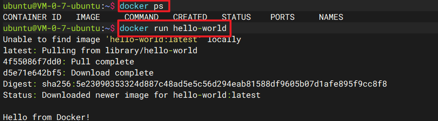

如果 `docker info` 中 `Registry Mirrors` 显示了配置的地址，且 `docker run hello-world` 能成功输出欢迎信息，则表明 Docker 安装及加速配置全部成功。

## 九、本节踩坑总结

- **系统差异**：视频教程为 CentOS，实际为 Ubuntu，需熟练使用 `apt` 替代 `yum`。
- **权限报错**：普通用户执行 Docker 命令报 `permission denied`，必须执行 `sudo usermod -aG docker $USER` 并重新登录。
- **服务未启动**：Ubuntu 安装后需 `systemctl enable docker --now` 启动并配置自启。

# 07. 基础 - Docker常见命令与镜像操作指南

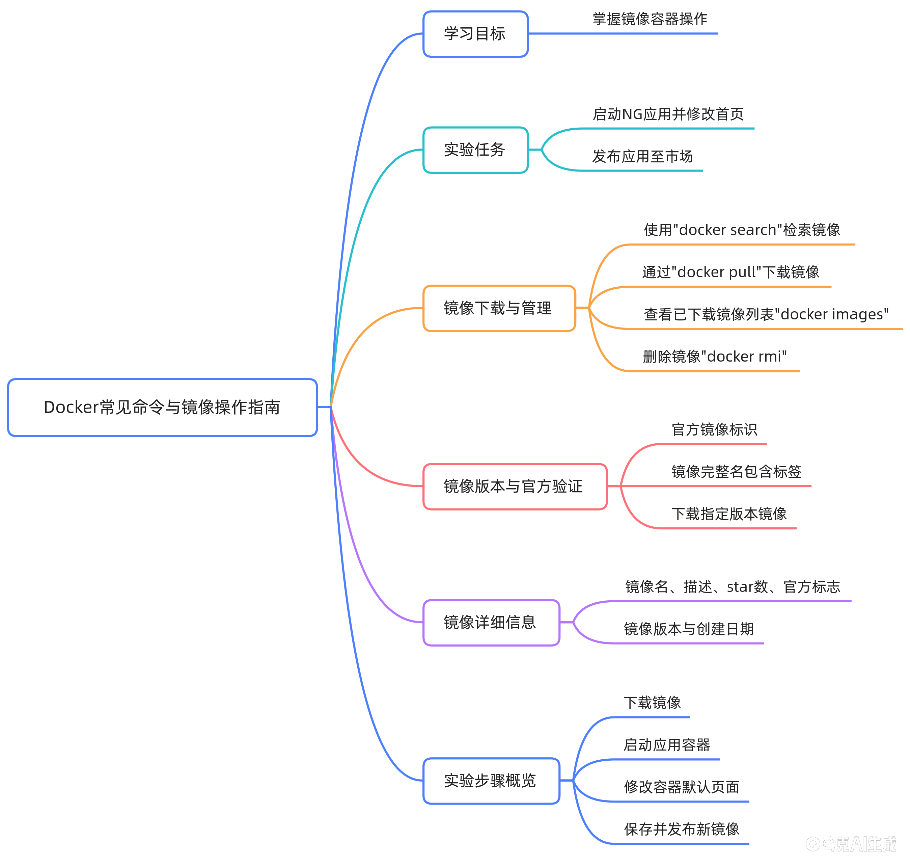

## 一、学习目标与实验任务

### 学习目标
- 掌握镜像与容器的基本操作。

### 实验任务
- 启动 NG（Nginx）应用并修改首页。
- 将修改后的应用发布至应用市场。

## 二、实验步骤概览
1. **下载镜像**：从应用市场下载 Nginx 软件镜像。
2. **启动应用容器**：使用该镜像启动容器。
3. **修改容器默认页面**：进入容器修改默认首页。
4. **保存并发布新镜像**：将修改后的软件保存为新镜像并发布到应用市场。

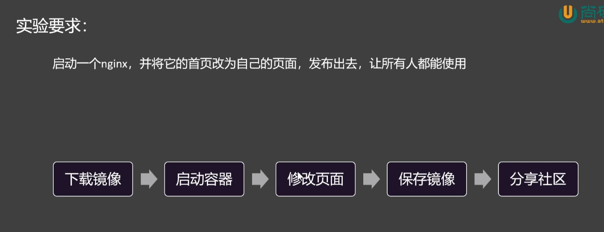

## 三、镜像相关基础命令介绍
- `docker search`：检索镜像。
- `docker pull`：下载镜像。
- `docker images`：查看已下载的镜像列表。
- `docker rmi`：删除镜像（remove image 的缩写）。

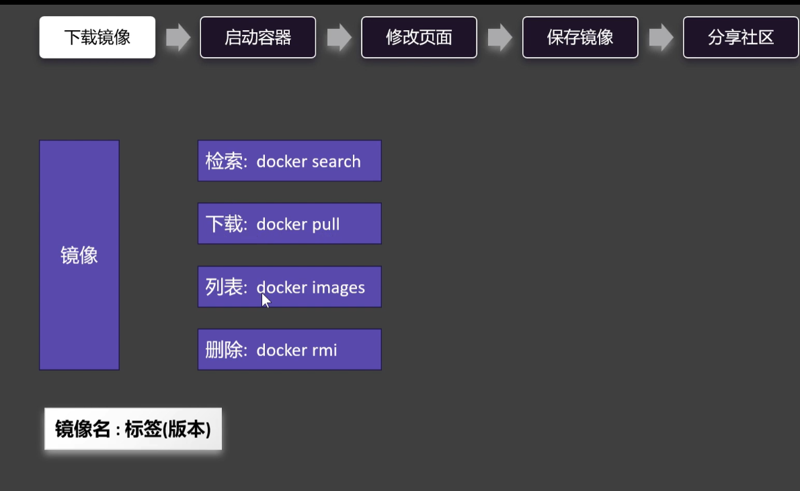

## 四、检索与下载默认版本镜像

### 1. 检索镜像  ——需要使用科学上网才能访问
使用以下命令搜索 Nginx 镜像： 
```bash
docker search nginx
```

搜索结果列表包含以下字段：
- **NAME**：镜像名字。
- **DESCRIPTION**：镜像描述。
- **STARS**：镜像收藏数。
- **OFFICIAL**：是否为官方发布。若显示 `[OK]` 则为官方镜像，否则为第三方制作。

```shell
ubuntu@VM-0-7-ubuntu:/$ docker search  nginx
Error response from daemon: Get "https://index.docker.io/v1/search?q=nginx&n=25": dial tcp 23.225.141.210:443: i/o timeout
```

- 可以直接在`docker hub` 上面直接访问:

  [https://hub.docker.com/]: dockerhub

  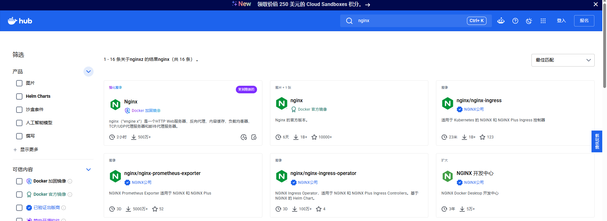

### 2. 下载镜像
直接下载 Nginx 镜像：
```bash
docker pull nginx
```
默认下载最新版本（latest）。

### 3. 查看镜像列表
下载完成后，使用以下命令检查镜像列表：
```bash
docker images
```
镜像列表字段说明：
- **REPOSITORY**：镜像名字。
- **TAG**：镜像标签，通常代表版本，`latest` 代表最新版本。
- **IMAGE ID**：镜像的唯一ID。
- **CREATED**：创建时间（多少天前）。
- **SIZE**：镜像大小。

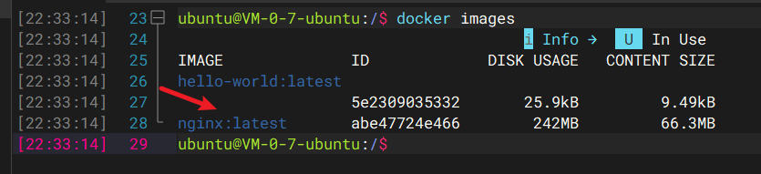

## 五、镜像命名规范与指定版本下载

### 1. 镜像命名规范
- 镜像的完整名称格式为：`镜像名:标签`（例如 `nginx:latest`）。
- `docker pull nginx` 等价于 `docker pull nginx:latest`。

### 2. 指定版本下载
- 若需下载指定版本，不建议仅使用 `docker search`，推荐访问 **Docker Hub 网站**（[hub.docker.com](https://hub.docker.com/)）查询完整版本列表。
  - https://hub.docker.com/_/nginx
  - 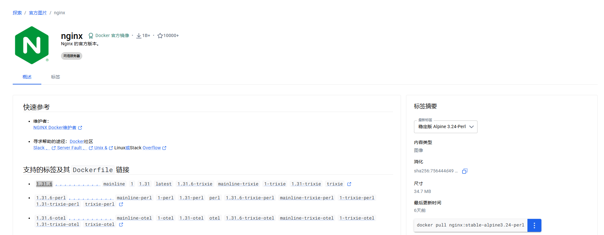
- 访问 hub.docker.com 搜索 nginx，确认带有官方标志的镜像。
- 点击镜像进入详情页，参考提供的 `docker run` 等启动命令说明。
- 在 **Tags** 栏目中查看可用版本（如 `1.31.6`）。
- 复制指定版本的下载命令，在命令行执行：
```bash
docker pull  nginx:1.31.6
```

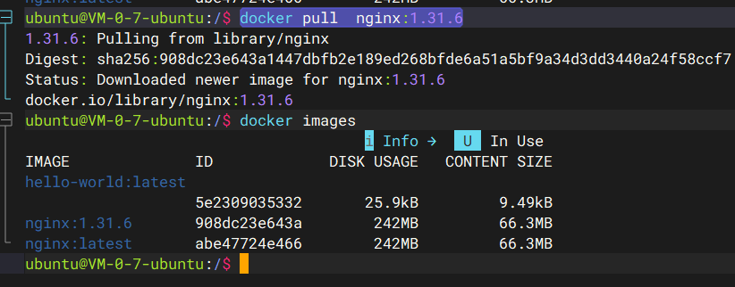

### 3. 再次查看镜像列表

使用 `docker images`（完整写法 `docker image ls`）查看，列表中会同时存在 `nginx:latest` 和 `nginx:1.31.6` 两个镜像。

## 六、删除镜像操作

### 1. 通过名称和标签删除
使用 `docker rmi` 命令删除镜像，需指定镜像的完整名称及标签：
```bash
docker rmi nginx:latest
```

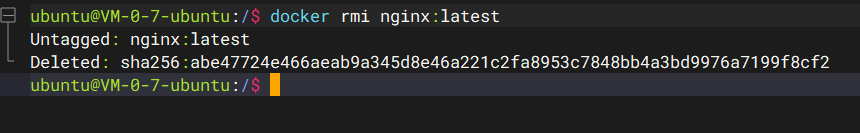

### 2. 通过镜像ID删除

也可以使用镜像的唯一 IMAGE ID 进行删除，复制 ID 后执行：
```bash
docker rmi <IMAGE_ID>
```

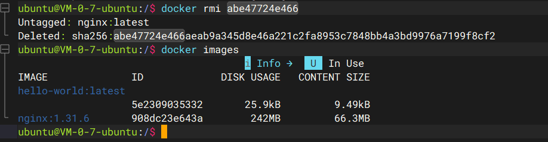

### 3. 验证删除

删除后再次检查镜像列表：
```bash
docker images
```
确认指定镜像已被移除，仅剩 `nginx:1.31.6`。

# 08. 命令 - 容器操作

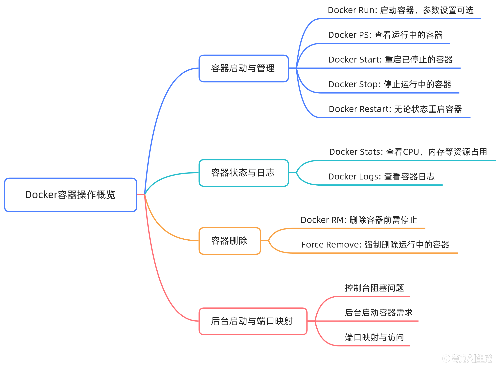

## 一、容器管理命令概览

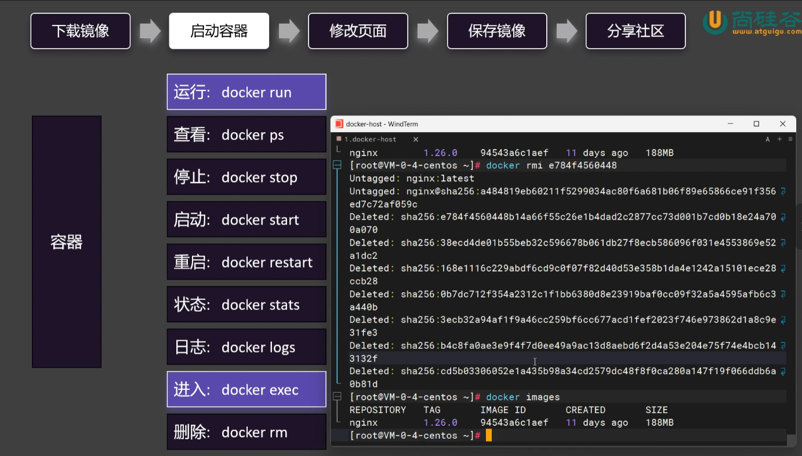

- `docker run`：运行容器（参数较复杂，后续详解）。
- `docker ps`：查看正在运行的容器。
- `docker stop`：停止容器。
- `docker start`：启动已停止的容器。
- `docker restart`：重启容器（无论状态如何）。
- `docker stats`：查看容器状态（CPU、内存等资源占用）。
- `docker logs`：查看容器日志。
- `docker rm`：删除容器（需先停止）。
- `docker exec`：进入容器内部进行修改（较复杂，后续详解）。

## 二、docker run 命令详解与前台启动演示

### 1. 命令用法分析
使用 `docker run --help` 查看帮助文档。
基本用法格式：`docker run [OPTIONS] IMAGE [COMMAND] [ARG...]`

- **OPTIONS**：参数项，位于 run 和 IMAGE 之间，可选。
- **IMAGE**：镜像名称。
- **COMMAND 和 ARG**：启动命令和参数，通常无需指定，因为镜像自带默认启动行为；除非需要改变默认行为，否则忽略。
- 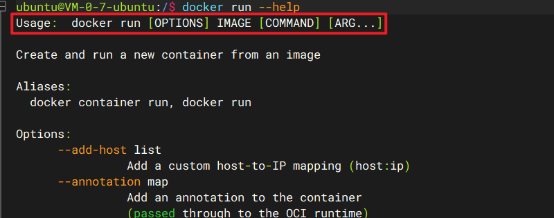

### 2. 启动 Nginx 容器
执行命令：
```bash
docker run nginx
```

- 若未指定版本号，默认使用最新镜像（latest）。
- 若本地无镜像，会自动下载。
- **前台启动特性**：启动后控制台被阻塞，若中断控制台（如 Ctrl+C），应用随之停止。
- 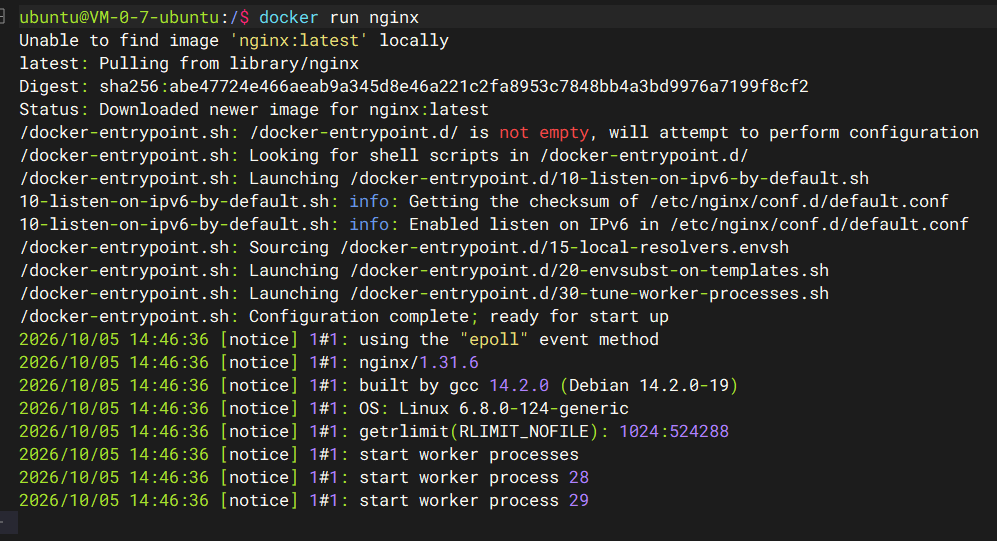

## 三、查看与生命周期管理

### 1. 查看运行中的容器
新开终端窗口，执行：
```bash
docker ps
```
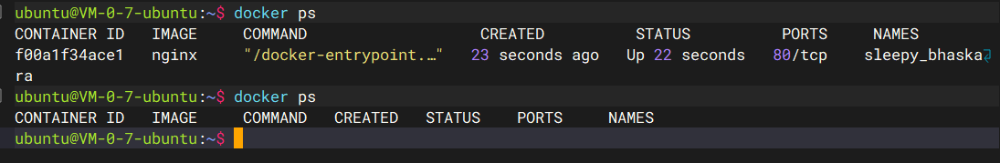

输出信息解读：

- **CONTAINER ID**：容器的唯一ID。
- **IMAGE**：使用的镜像，未带标签表示使用最新镜像。
- **COMMAND**：容器自身的启动命令。
- **CREATED**：启动时间。
- **STATUS**：状态，`Up` 表示上线成功。
- **PORTS**：占用的端口，此处为 80 端口。
- **NAMES**：随机生成的容器名称。

停止前台容器：在原启动窗口按 `Ctrl+C` 中断，容器停止。再次执行 `docker ps`，发现无运行中容器。

### 2. 查看所有容器及重启
- 查看已停止容器：
```bash
docker ps -a
```
状态显示为 `Exited`，表示已退出。

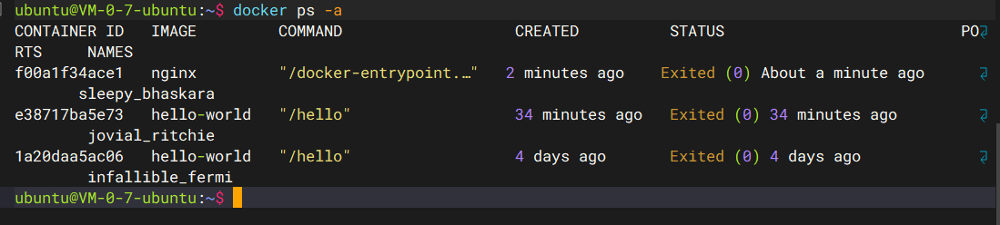

- 启动已停止的容器：
```bash
docker start [容器ID或名称]
```
ID 可简写，只需能区分即可（如前三位）。执行后，再运行 `docker ps`，可见应用重新处于 `Up` 状态。

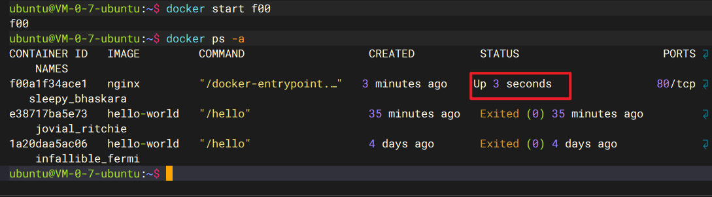

### 3. 停止与重启
- 停止容器：
```bash
docker stop [容器名/ID]
```
停止后，`docker ps` 不可见，需 `docker ps -a` 查看，状态为 `Exited`。

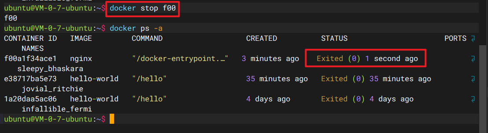

- 重启容器：
```bash
docker restart [容器名/ID]
```
无论容器处于运行还是停止状态，均可重启。重启后，`docker ps` 显示状态为 `Up`。

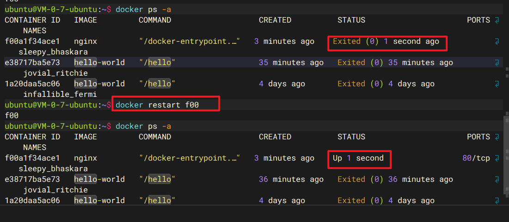

## 四、状态监控与日志

### 1. 监控资源占用
```bash
docker stats [容器名/ID]
```
实时打印 CPU、内存、网络 IO 等情况，每秒刷新。若无请求处理，资源占用无明显变化。

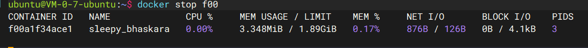

### 2. 查看日志
```bash
docker logs [容器名/ID]
```
可查看容器运行过程中产生的日志，用于排错。

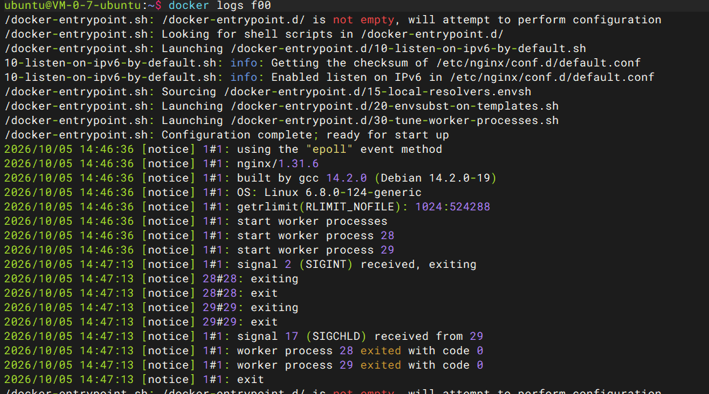

## 五、删除容器

### 1. 常规删除
```bash
docker rm [容器名/ID]
```
**注意**：必须先 `docker stop` 停止容器才能删除。

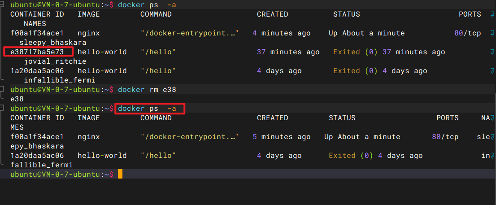

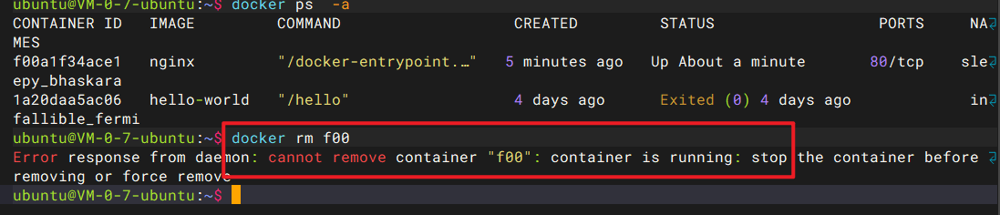

### 2. 强制删除
```bash
docker rm -f [容器名/ID]
```
可直接删除运行中的容器。删除后，`docker ps` 和 `docker ps -a` 均不再显示该容器。

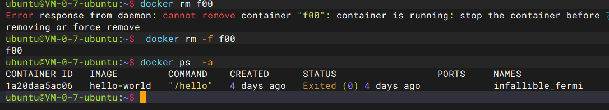

## 六、当前存在的问题

- **控制台阻塞**：前台启动导致控制台阻塞，不便操作。
- **无法外部访问**：即使启动成功，通过服务器 IP 访问 80 端口仍无法访问（因未做端口映射）。
- **容器ID变化**：每次重新启动容器，容器 ID 会发生变化。

# 09. 命令 - run细节

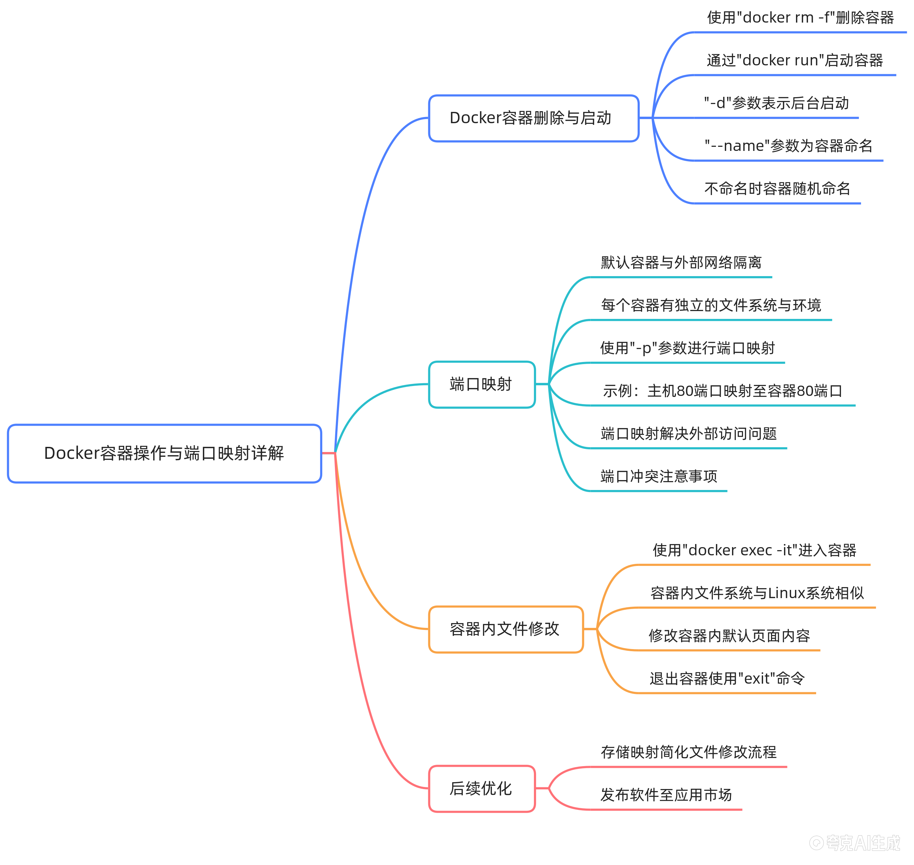

## 一、Docker 容器删除与启动基础

### 1. 删除旧容器
- 使用 `docker rm -f` 强制删除正在运行的旧容器。
- **注意区分**：`rm` 用于删除容器，`rmi` 用于删除镜像。

### 2. 启动命令基本语法
- 基本语法：`docker run [参数] 镜像名`。

- 常用参数：
  - `-d`：后台启动（detached mode）。
  
  - `--name`：指定容器名称，若不指定则生成随机名称。
  
  - 使用`--help`  查看帮助  
  
    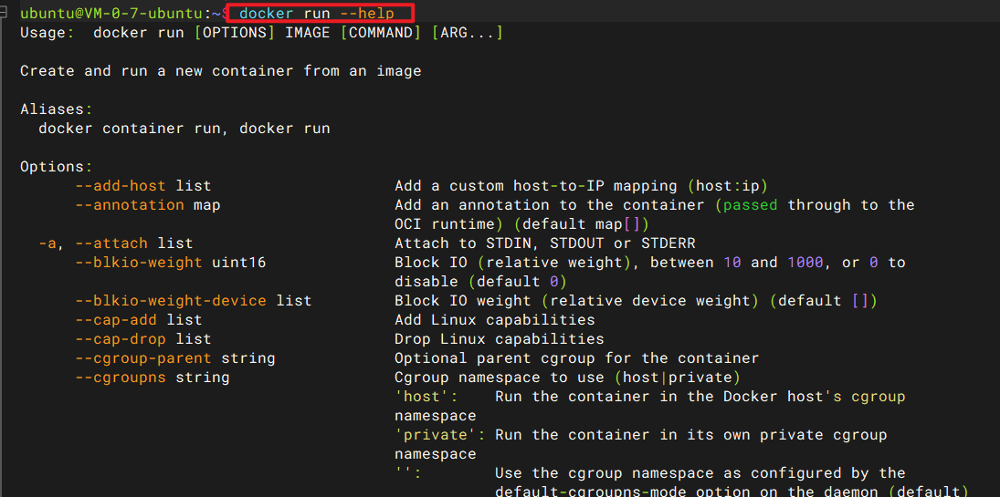
  
- 示例：`docker run -d --name my-nginx nginx`

- 容器启动后状态为 `Up`，但默认无法从外部主机访问 Nginx 默认页。

### 3. 容器隔离性原理
- <span style="color:#ff0000;"> **容器运行在独立环境中，拥有完整的文件系统、网络空间、CPU、内存和进程。**</span>Nginx 安装在容器内部的“小型 Linux 系统”中，占用容器内部的 80 端口。

- 外部主机无法直接访问容器内部端口，必须通过端口映射机制连接。

## 二、端口映射配置与访问控制

### 1. 端口映射概念
- 使用 `-p` 参数（port 的简写）实现主机端口到容器端口的映射。
- 格式：`外部端口:内部端口`。
- 示例：`-p 80:80` 表示访问主机 80 端口即访问容器内部 80 端口。

### 2. 操作步骤
- 删除旧容器，重新启动 Nginx 容器，添加 `-d`、`--name` 和 `-p` 参数：
```bash
docker run -d --name my-nginx -p 80:80 nginx
```

- 执行 `docker ps` 查看状态，`PORTS` 列显示 `0.0.0.0:80->80/tcp`，表示任意 IP 访问主机 80 端口均映射至容器。
- 浏览器刷新即可看到 Nginx 默认页面。
- **核心结论**：若需外部访问容器服务，必须进行端口映射暴露端口。
- 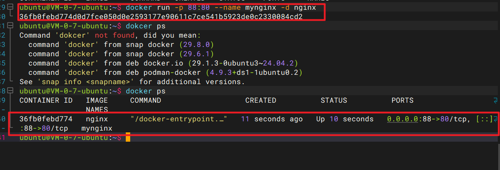

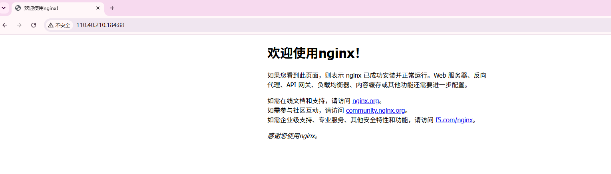

### 3. 端口冲突与复用规则
- **主机端口（外部端口）**：不可重复。同一台主机上，同一个端口只能被一个容器占用。
- **容器端口（内部端口）**：可以重复。不同容器内部可以使用相同的端口（如 80），**<span style="color:#ff0000;">因为容器间相互隔离，类似独立的虚拟机。</span>**
- **注意事项**：配置端口映射时需确保主机端口不冲突，容器内部端口可根据需求相同。

## 三、进入容器内部修改内容

### 1. 需求背景与文件定位
- 需求：修改 Nginx 默认欢迎页为自定义内容。
- 路径确认：参考 Docker Hub 官方文档，确认 Nginx 静态页面位于 `/usr/share/nginx/html` 目录下。

### 2. 进入容器操作 
```bash
docker exec -it <容器名/ID> /bin/bash
```
- `-it`：以交互模式运行，允许发送命令。
- `/bin/bash`：指定使用的 shell 环境。
- 进入后提示符变为 `root@<容器ID>`，表明已进入容器内部的 Linux 环境。
- 执行 `ls` 可查看容器内的 Linux 目录结构，印证容器拥有独立文件系统。
- 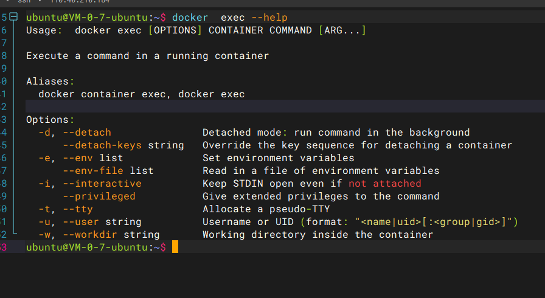

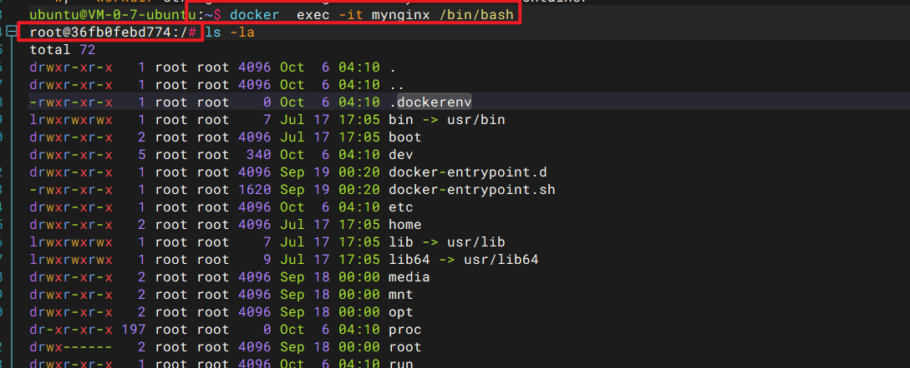

## 四、修改页面内容与局限性分析

### 1. 尝试使用编辑器
- 容器内通常未安装 `vi` 或 `vim` 等文本编辑器，以保持镜像轻量级。

### 2. 替代修改方案
- 使用 `echo` 命令重定向输出修改文件内容：
```bash
echo "<h1>Hello Docker</h1>" > /usr/share/nginx/html/index.html
```
- 使用 `cat` 命令确认文件内容已更新。
- 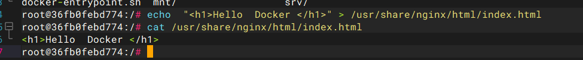3. 效果验证

- 刷新浏览器，页面显示为 “Hello Docker”，证明修改生效。

  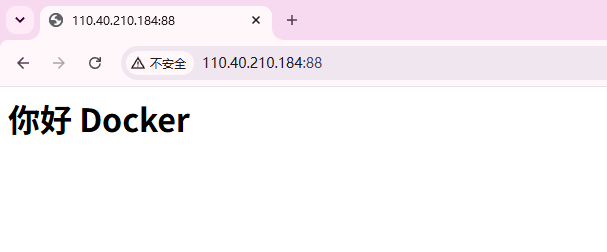

### 4. 操作痛点与展望
- **痛点**：每次修改都需进入容器内部操作，较为繁琐。
- **后续方向**：将介绍 Docker 存储卷（Volume）或绑定挂载（Bind Mount），将容器内部文件夹映射到主机目录，实现在主机直接修改文件同步至容器。
- 退出容器：输入 `exit` 退出容器交互模式，返回主机控制台。

## 五、本节核心总结
- **启动与隔离**：容器默认拥有独立网络，外部无法直接访问。
- **端口映射**：`-p 主机端口:容器端口` 是外部访问的必经之路。主机端口唯一，容器端口可重复。
- **容器交互**：`docker exec -it <容器> /bin/bash` 用于进入容器内部。
- **轻量级限制**：容器默认没有 vim 等工具，可直接用 `echo` 修改简单文件，但复杂修改需依靠后续的“存储映射”。

# 10. 命令 - 保存镜像(Docker镜像保存、导出与加载)

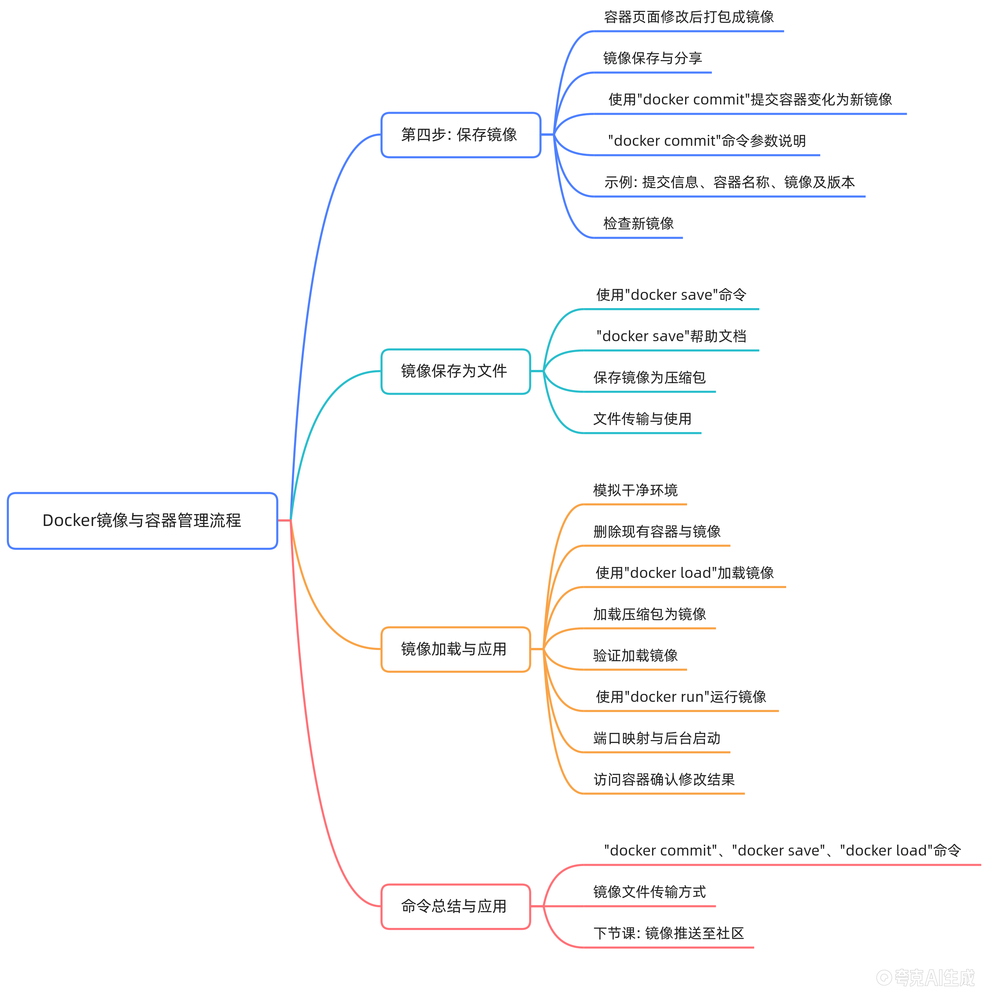

## 一、第四步：保存镜像概述
- **目标**：将运行中且经过修改的容器打包成镜像，以便分享或保存。
- **涉及的核心命令**：提交（commit）、保存（save）和加载（load）。

## 二、使用 `docker commit` 提交镜像

### 1. 命令功能
- `docker commit` 用于从容器的更改中创建一个新的镜像。
- 它将整个容器及其所有变化打包成一个新镜像。

### 2. 常用参数
- `-a`：指定作者。
- `-c`：列出应用的 Dockerfile 指令。
- `-m`：提交信息。
- `-p`：在提交期间暂停容器运行。
- 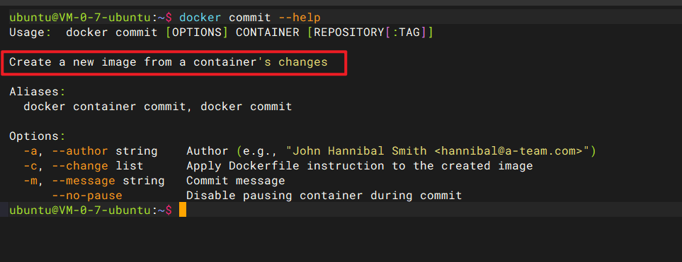

### 3. 操作演示
执行命令：
```bash
docker commit -m "update" <容器名> my_nginx:v1.0
```

- `-m` 指定提交信息为 "update"。

- `<容器名>` 为之前修改过 index.html 的容器。

- `my_nginx:v1.0` 为新镜像的名称和标签。

- 执行成功后，通过 `docker images` 可查看到新生成的镜像 `my_nginx:v1.0`。

- ```shell
  ubuntu@VM-0-7-ubuntu:~$ docker commit -m 'update:修改了默认的访问页面' mynginx mynginx:v1.0
  ```

  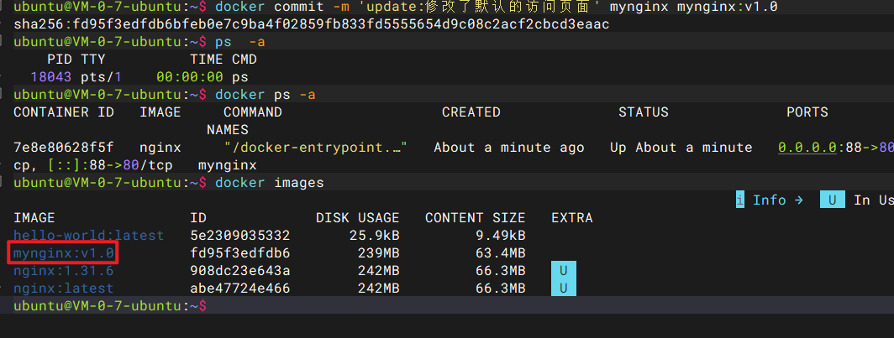

## 三、使用 `docker save` 导出镜像文件

### 1. 命令功能
- `docker save` 用于将一个或多个镜像保存为一个 tar 归档文件。
- 便于通过 U 盘等物理介质或文件传输方式分享给他人。
- 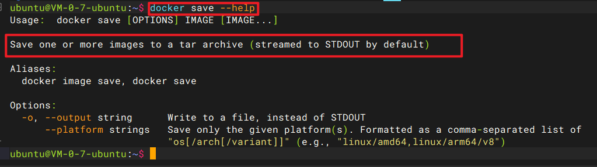

### 2. 操作演示
执行命令：
```bash
docker save -o my_nginx.tar my_nginx:v1.0
```
- `-o` 参数指定输出文件名，此处为 `my_nginx.tar`。

- 执行后当前目录下生成 tar 包，该包包含了指定的镜像数据。

- `my_nginx:v1.0` :要保存的镜像的名称

- ` docker  save -o  my_nginx.tar mynginx:v1.0`

  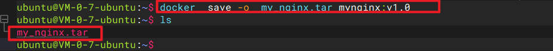

## 四、模拟环境清理与镜像加载

### 1. 模拟接收方环境
为了模拟另一台干净的主机，首先需要清理当前环境：
- 删除正在运行的容器：`docker rm -f <容器ID>`。

  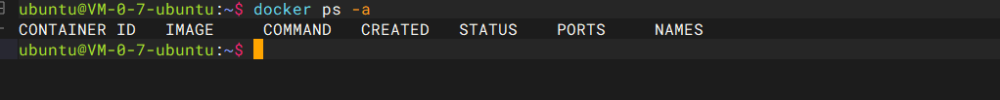

- 删除本地所有现有镜像：`docker rmi <镜像ID1> <镜像ID2>`，确保环境中无相关镜像。

  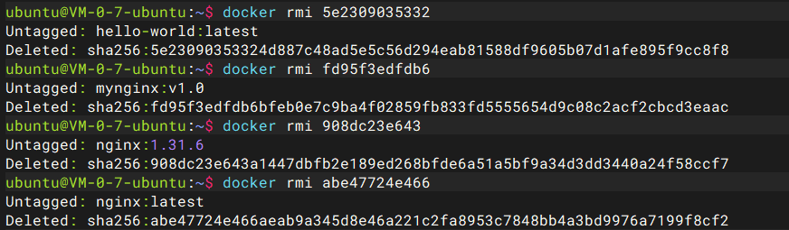

  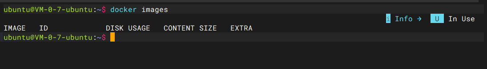

### 2. 使用 `docker load` 加载镜像
**命令功能**：`docker load` 用于从 tar 归档文件或标准输入中加载镜像。

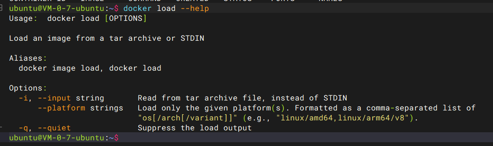

**操作演示**：

```bash
docker load -i my_nginx.tar
```
- `-i` 参数指定输入的 tar 包文件路径。
- 加载完成后，终端显示 `Loaded image: my_nginx:v1.0`，表示镜像已恢复至本地仓库。

### 3. 验证加载结果
再次执行 `docker images`，确认 `my_nginx:v1.0` 镜像存在。

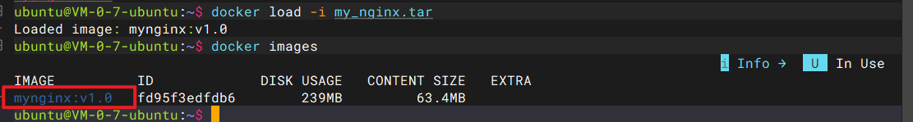

## 五、运行加载后的镜像并验证
### 1. 启动容器
执行命令：
```bash
docker run -d --name app01 -p 88:80 my_nginx:v1.0
```
- `-d`：后台运行。

- `--name app01`：指定容器名称。

- `-p 88:80`：端口映射，主机 88 端口映射到容器 80 端口。

- `docker run -d --name app01 -p  88:80  mynginx:v1.0`

  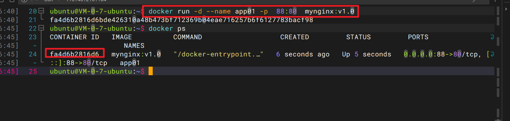

### 2. 功能验证
- 通过浏览器访问主机 IP 的 88端口。
- 页面显示之前修改过的 "hello" 内容，证明通过 `commit` 保存的修改已成功包含在镜像中，并通过 `save`/`load` 流程完整迁移。

## 六、流程总结与展望

### 核心流程回顾
- `docker commit`：将容器状态提交为新镜像。
- `docker save`：将镜像保存为 tar 文件，便于文件级传输。
- `docker load`：从 tar 文件加载镜像，恢复环境。

# 11. 命令 -  镜像分享到社区（Docker Hub）

!!!  因为云服务器没有办法访问`docker  hub`，所以该节内容使用老师的截图

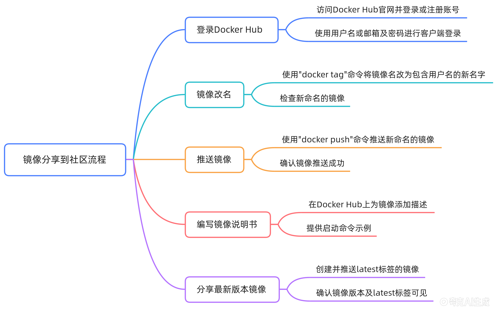

## 一、登录 Docker Hub
- 访问 

  [DockerHub`官方网站]: https://app.docker.com/accounts/capsqlboy

  若无账号需先注册，已有账号则直接登录。

- 在客户端执行 `docker login` 命令。

- 输入注册时的用户名（或邮箱）及密码。

- 看到 `Login Succeeded` 提示即表示客户端登录成功。

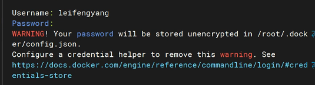

## 二、镜像重命名 (docker tag)
- **原因**：Docker Hub 要求镜像名称格式为 `用户名/镜像名`，以便区分归属。原有镜像 `mynginx:1.0` 缺少用户名前缀，需重命名。
- **命令格式**：`docker tag <原镜像>:<标签> <用户名>/<新镜像名>:<标签>`
- **执行命令**：
```bash
docker tag mynginx:1.0 leifengyang/mynginx:v1.0
```

- **验证**：使用 `docker images` 检查，发现新生成的镜像与原镜像 ID 相同，仅名称和标签不同。

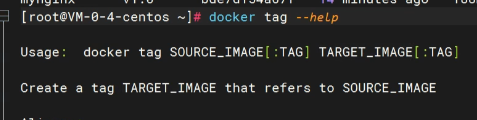

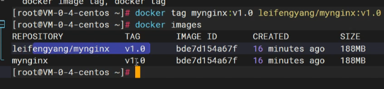

## 三、推送镜像到仓库 (docker push)
- **执行命令**：
```bash
docker push leifengyang/mynginx:v1.0
```
- **注意事项**：推送时必须使用包含用户名和标签的完整镜像名，不能使用镜像 ID。推送过程可能因网络原因较慢，需耐心等待。
- **结果验证**：推送完成后，刷新 Docker Hub 个人主页的 Repositories，可见名为 `mynginx` 的公共镜像仓库已创建，且包含 `v1.0` 标签。

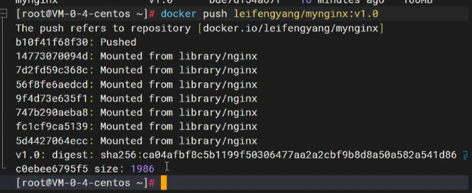

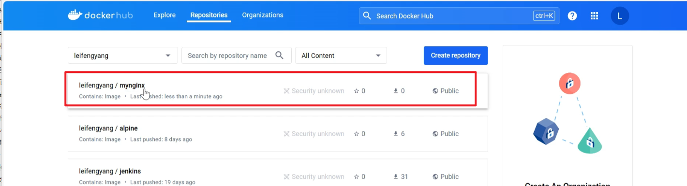

## 四、编写镜像说明书
- 在 Docker Hub 镜像页面点击 **“Add Overview”** 添加说明。
- 支持 Markdown 语法，可描述镜像特性（如：修改 Nginx 默认返回为 “Hello Docker”）。
- 提供启动命令示例，指导用户如何使用：
```bash
docker run -d -p 80:80 leifengyang/mynginx:v1.0
```
  - `-d`：后台运行。
  - `-p 80:80`：端口映射，外部 80 映射到容器 80。
- 点击更新后，其他用户搜索并查看该镜像时，即可看到说明书及推荐启动命令。

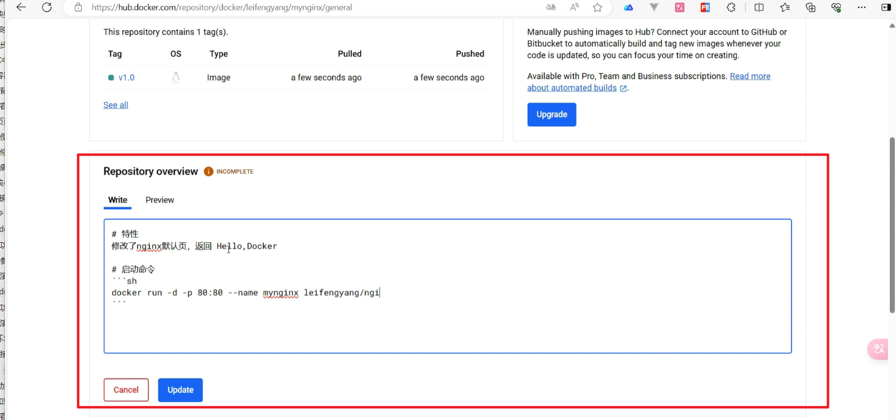

## 五、推送 Latest 标签最佳实践
- **痛点**：许多用户下载镜像时习惯省略标签（默认拉取 `latest`），若未提供 `latest` 标签会导致下载失败或报错。 
- **最佳实践**：建议将当前最新版本（如 v1.0）同时标记为 `latest`。
- **操作步骤**：
  1. 再次打标：
```bash
docker tag leifengyang/mynginx:v1.0 leifengyang/mynginx:latest
```
  2. 此时 `docker images` 显示三个镜像（原镜像、v1.0、latest）具有相同的 Image ID。
  3. 推送 latest 标签：
```bash
docker push leifengyang/mynginx:latest
```
- **最终效果**：刷新 Docker Hub 页面，Tags 列表中同时存在 `v1.0` 和 `latest`。用户执行 `docker pull leifengyang/mynginx` 时，将自动下载最新的 v1.0 版本，符合社区标准规范。

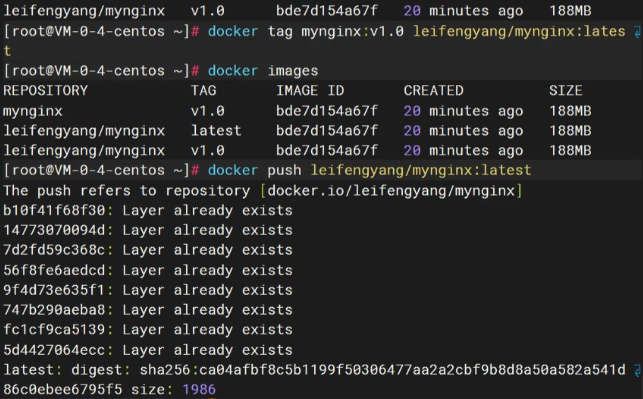

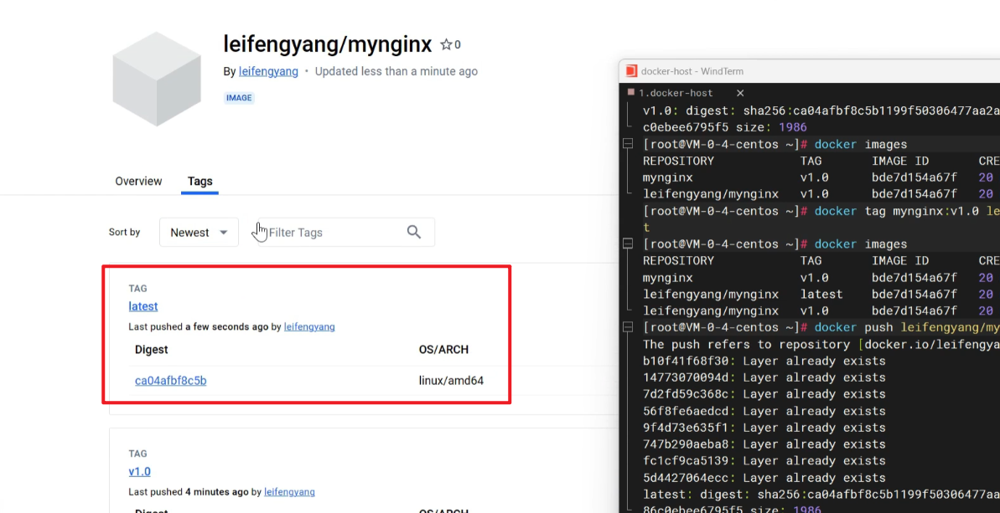

# 12. 命令 - 实验小结

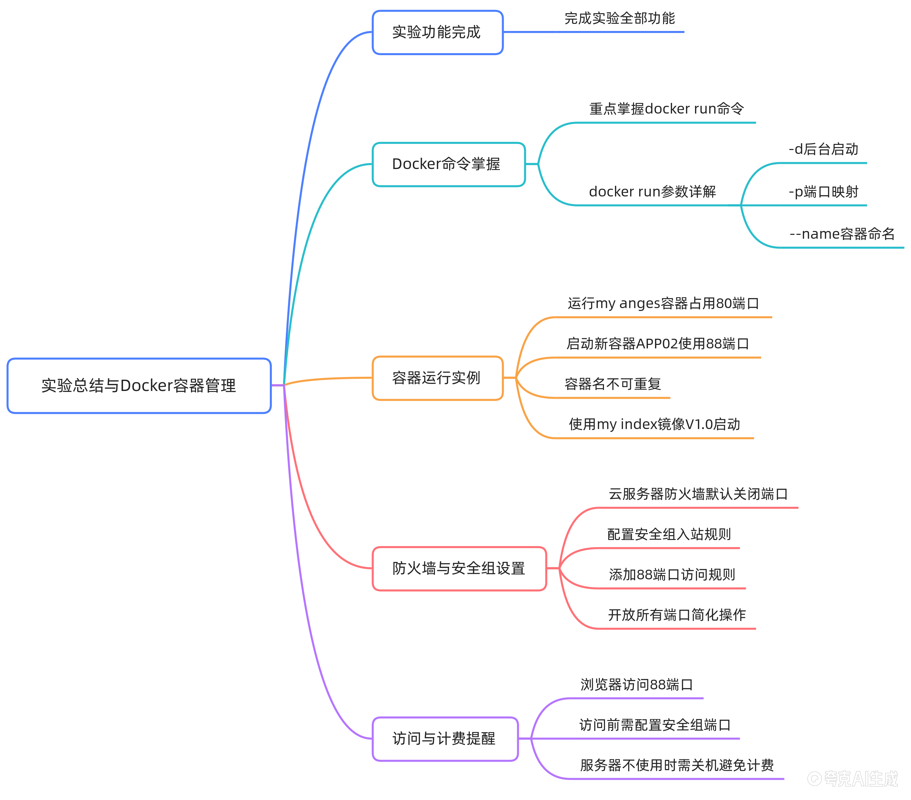

## 一、Docker 命令回顾与核心参数
- 实验期间使用了大量 Docker 命令，需重点掌握 `docker run`（用于运行容器）。
- `docker run` 可添加多种参数，核心参数如下：
  - `-d`：后台启动（守护进程模式）。
  - `-p`：端口映射（格式：主机端口:容器端口）。
  - `--name`：指定容器名（不可重复）。
- 后续学习中会讲解更多高级参数。

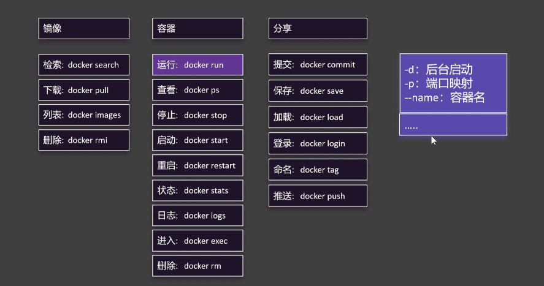

## 二、多容器启动与端口映射实例

### 1. 场景背景
- 已有一个名为 `my_nginx` 的容器占用主机 **80 端口**。
- 现在需要启动一个新容器，并在主机 **88 端口**上暴露。

### 2. 新容器启动命令
```bash
docker run -d -p 88:80 --name app02 my_index:v1.0
```

**命令含义解析：**
- `-d`：后台运行。
- `-p 88:80`：将本机的 88 端口映射到容器内的 80 端口。
- `--name app02`：将新容器命名为 app02。
- `my_index:v1.0`：使用之前 commit 提交的镜像及其 v1.0 版本。

### 3. 注意事项
- 新容器名 `app02` 不能与已有容器名重复（如之前的 `my_nginx`）。
- 启动成功后，理论上应通过浏览器访问 `服务器IP:88`。

## 三、云服务器安全组配置（核心排错点）

### 1. 问题现象
浏览器访问 `88` 端口一直无法加载（连接超时或拒绝）。

### 2. 原因分析
- 云服务器默认安全组（防火墙）只开放了 `22`（SSH）和 `80`（HTTP）等常用端口。
- 虽然 Docker 容器映射了 88 端口，但**云服务器本身的防火墙并未放行 88 端口**，导致外部访问被拦截。

### 3. 安全组入站规则配置
- **入站规则定义**：配置哪些 IP 可以访问服务器的哪些端口。
- **添加特定端口规则**：
  1. 进入云服务器控制台的“安全组”页面。
  2. 点击“添加规则”。
  3. **授权对象**：填写 `0.0.0.0/0`（代表允许所有 IP 访问，开发环境方便，生产环境需谨慎）。
  4. **端口范围**：填写 `88`（或者包含 88 的端口范围）。
  5. 协议选择 `TCP`，点击确定。

### 4. 开发环境便捷配置（可选）
- 由于实验中会启动多个容器，逐个开放端口较为麻烦。
- 在开发期间，可以直接开放**所有端口**。
- 操作：端口范围输入 `1/65535`（根据云平台提示操作），点击确定。

## 四、访问与计费提醒

### 1. 访问测试
- 只有在安全组中配置了相应的端口开放规则后，外部才能成功访问该端口对应的服务页面。
- 配置生效后，再次通过浏览器访问 `服务器IP:88`，即可看到自定义的页面内容。

### 2. 计费提醒
- **重要**：一旦服务器不再使用，务必记得**关机**，否则服务器会持续计费。
- 结合前面第 05 节的“停机不收费”功能，建议每次实验结束养成关闭服务器的习惯。

## 五、本节核心总结
- **容器启动规范**：多容器场景下，注意 `--name` 唯一性，以及主机端口不可冲突（如 80 和 88 要区分开）。
- **云服务排错**：容器能启动不代表外部能访问。遇到访问不通时，优先排查「云服务器安全组（防火墙）」是否放行了对应的主机端口。
- **成本控制**：实验完毕及时关机，避免产生不必要的云服务费用。

